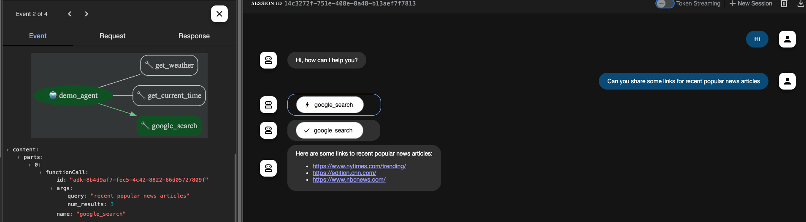

## Agent Overview

This `agent.py` file defines a multi-tool agent capable of answering questions about the current time and weather in a specific city, as well as performing Google searches. It leverages the `google.adk.agents` library for agent creation and the `googlesearch-python` library for search functionality.


## Agent Capabilities

The agent, named `demo_agent`, can perform the following tasks:

1.  **Get Weather:** Retrieve a weather report for a given city (currently supports only "New York").
2.  **Get Current Time:** Determine the current time in a specified city (currently supports only "New York").
3.  **Google Search:** Execute a Google search with a provided query and return a specified number of results.

## Tools

The agent utilizes three tools, each implemented as a Python function:

*   **`get_weather(city: str) -> dict`:**
    *   Takes a city name as input.
    *   Returns a dictionary with the weather report if available, or an error message if not.
*   **`get_current_time(city: str) -> dict`:**
    *   Takes a city name as input.
    *   Returns a dictionary with the current time in the specified city, or an error message if the timezone information is unavailable.
*   **`google_search(query: str, num_results: Optional[int] = 5) -> dict`:**
    *   Takes a search query and an optional number of results (defaulting to 5) as input.
    *   Returns a dictionary containing a list of search results if successful, or an error message if the `googlesearch-python` library is not installed or if another error occurs during the search.

## Dependencies

*   `google.adk.agents`: For creating and managing the agent.
*   `zoneinfo`: For handling timezones.
*   `datetime`: For working with dates and times.
*   `googlesearch-python`: For performing Google searches.  Install using `pip install googlesearch-python`.

## Usage

To use the agent, you would typically interact with it through a framework that supports the `google.adk.agents` library.  You can send user queries to the agent, and it will respond based on its capabilities and the tools it has available.

**Example Interaction (Conceptual):**

```python
# Assuming you have a way to interact with the agent framework
response = agent.handle_query("What's the weather in New York?")
print(response)
# Expected output (or similar): {'status': 'success', 'report': 'The weather in New York is sunny with a temperature of 25 degrees Celsius (77 degrees Fahrenheit).'}

response = agent.handle_query("What time is it in New York?")
print(response)
# Expected output (or similar): {'status': 'success', 'report': 'The current time in New York is 2024-01-20 10:30:00 EST-0500'}

response = agent.handle_query("Search for 'best Python libraries' with 3 results")
print(response)
# Expected output (or similar): {'status': 'success', 'results': ['result1_url', 'result2_url', 'result3_url']}
```

**Note:** The example interaction is conceptual and assumes a generic `agent.handle_query` method. The actual implementation will depend on the specific agent framework you are using.

## Limitations

*   The weather and time tools currently only support the city "New York".
*   The `googlesearch-python` library is used, which may be subject to Google's terms of service regarding automated queries. For production use, consider the official Google Custom Search API.

## Sample Agent Run

Here's an example of the agent in action:

